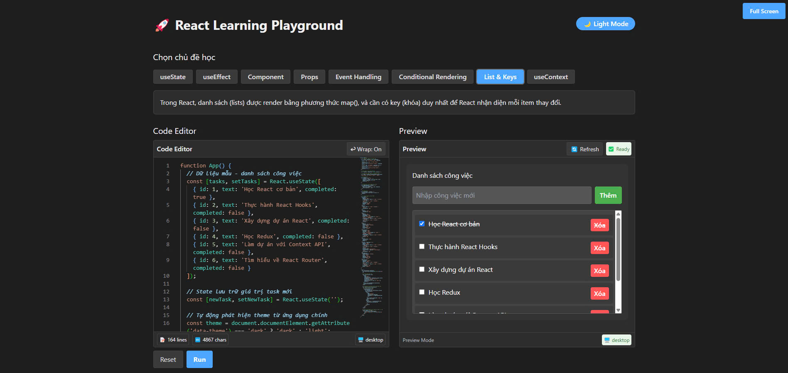

# React Playground


Ứng dụng playground cho React, giúp học và thực hành React một cách trực quan.



## Tính năng

- 🔥 Editor với syntax highlighting và autocompletion
- ⚡ Live preview cho code React
- 📚 Nhiều bài học về React để thực hành
- 🌓 Theme sáng/tối
- 📱 Responsive design cho mọi thiết bị

## Demo

[Live Demo](https://react-playground-4ag0.onrender.com/)

## Yêu cầu hệ thống

- Node.js 18.0.0 trở lên
- npm 8.0.0 trở lên

## Cài đặt và sử dụng

```bash
# Kiểm tra phiên bản Node.js
node -v  # Phải là v18.0.0 trở lên

# Clone repository
git clone https://github.com/your-username/react-playground.git

# Di chuyển vào thư mục
cd react-playground

# Cài đặt dependencies
npm install

# Chạy ứng dụng ở mode development
npm run dev
```

## 🎯 Mục tiêu dự án
Tạo một ứng dụng học tập tương tác với React gồm 2 phần chính:
1. **Cửa sổ viết code React (Editor)**
2. **Cửa sổ hiển thị kết quả (Preview)**

Ngoài ra, có thêm danh sách các kiến thức React, cho phép chọn chủ đề, xem mô tả và tự động nạp code mẫu để học và thực hành.

---

## 🧱 Chức năng chính

### ✅ 1. Code Editor (React Code Window)
- Cho phép người dùng viết code React (JSX + JavaScript cơ bản).
- Hỗ trợ highlight cú pháp và auto-format.
- Sử dụng thư viện `@monaco-editor/react` hoặc `react-codemirror`.

### ✅ 2. Kết quả hiển thị (Live Preview)
- Hiển thị kết quả chạy code từ editor.
- Báo lỗi nếu code sai cú pháp hoặc runtime.
- Có thể dùng `react-live` để render code an toàn trong sandbox.

### ✅ 3. Danh sách kiến thức React
- Hiển thị các chủ đề học tập như:
  - `useState`
  - `useEffect`
  - `Component & Props`
  - `Event Handling`
  - `Conditional Rendering`
  - `List & Keys`
  - `useContext`
- Khi chọn chủ đề:
  - Hiện phần mô tả kiến thức
  - Tự động điền code mẫu vào editor

### ✅ 4. Nút chức năng
- **Reset**: quay lại code mặc định ban đầu
- **Run**: chạy lại đoạn code hiện tại (nếu không tự động)

---

## 🧠 Công nghệ đề xuất

| Thành phần      | Công nghệ                       |
|-----------------|---------------------------------|
| Frontend        | React.js (CRA hoặc Vite)        |
| Code Editor     | `@monaco-editor/react` hoặc `react-codemirror` |
| Live Preview    | `react-live`                    |
| Styling         | Tailwind CSS hoặc Styled Components |
| Data lưu bài học| JSON hoặc file nội bộ           |

---

## 📁 Cấu trúc thư mục 
```bash
src/
├── components/
│   ├── Editor.jsx
│   ├── Preview.jsx
│   └── LessonSelector.jsx
├── lessons/
│   └── useState.json
├── App.jsx
├── main.jsx
└── index.css
```

## 📚 Ví dụ file bài học

**File:** `src/lessons/useState.json`

```bash
{
  "title": "useState",
  "description": "useState là hook cơ bản để tạo state trong function component.",
  "code": "function App() {\n  const [count, setCount] = React.useState(0);\n  return (\n    <div>\n      <p>Bạn đã click {count} lần</p>\n      <button onClick={() => setCount(count + 1)}>Click me</button>\n    </div>\n  );\n}"
}
```

## Quy trình phát triển

### Kiểm soát package-lock.json

Dự án này sử dụng các GitHub workflows tự động để đảm bảo package-lock.json luôn đồng bộ với package.json:

1. **validate-lockfile**: Chạy tự động khi có PR chứa thay đổi trong package.json hoặc package-lock.json
2. **Cách kiểm tra thủ công**: Chạy `npm run check-lock` để kiểm tra tính đồng bộ
3. **Cách cập nhật**: Chạy `npm run sync-lock` để cập nhật package-lock.json

### Nếu gặp lỗi "package-lock.json is out of sync"

```bash
# Xóa node_modules nếu có vấn đề với dependencies
rm -rf node_modules

# Cập nhật 
npm install --package-lock-only

# Thêm vào git
git add 

# Commit
git commit -m "chore: Update package-lock.json"

# Push
git push
```

# 🔮 Mở rộng tiềm năng
- Cho phép người dùng tự tạo bài học và lưu lại.
- Lưu code vào localStorage.
- Xuất code ra file .jsx.
- Thêm chế độ tối/sáng cho UI.

# 📘 Hướng dẫn học
- Chọn một chủ đề từ danh sách.
- Đọc mô tả lý thuyết.
- Quan sát code mẫu và kết quả.
- Thử chỉnh sửa code để hiểu sâu hơn.
- Tạo thêm các biến thể của ví dụ.

